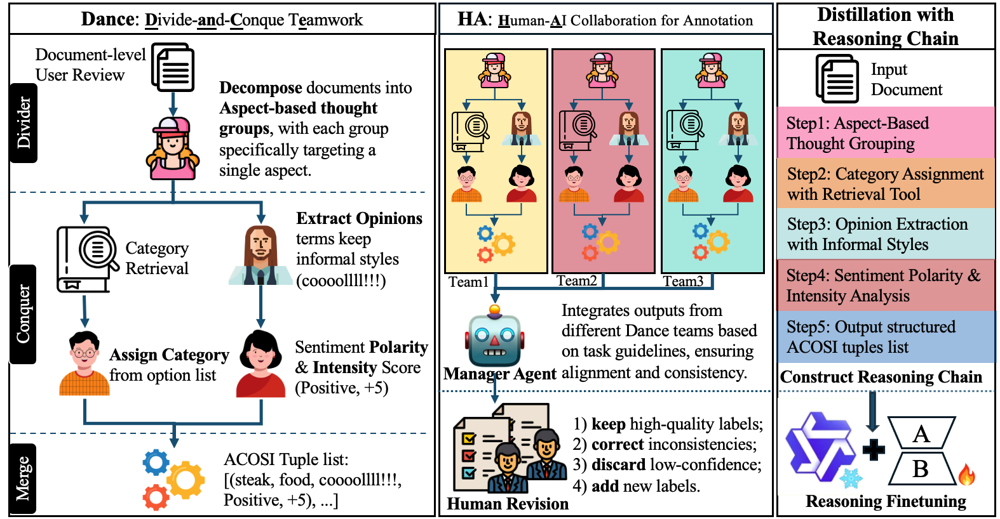
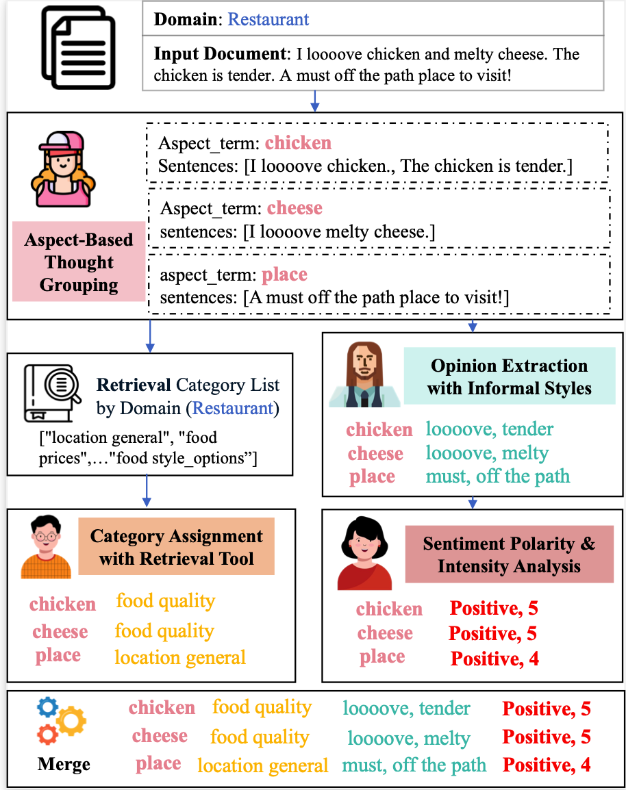
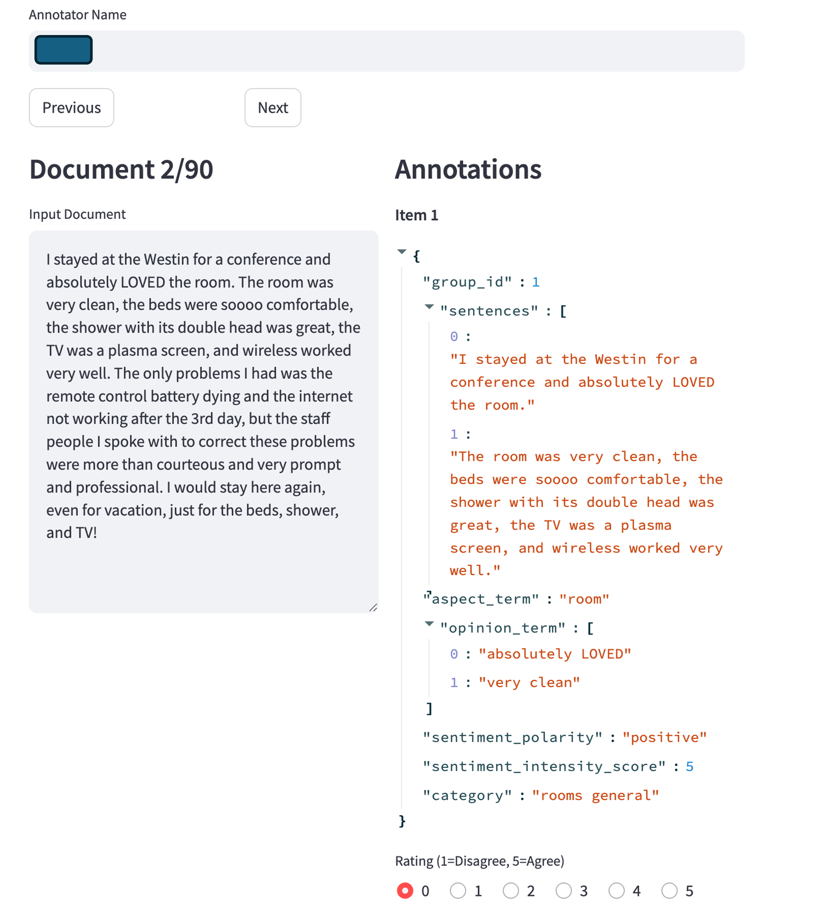

DanceHA: Multi-Agents Framework for Open-ended Document-level Aspect-Based Sentiment Intensity Analysis with Informal Styles
-----------------------------
## Overview
In this work, we introduces \textbf{DanceHA}, a multi-agent framework for open-ended document-level ABSIA with informal styles. It comprises two components: Dance, which applies a divide-and-conquer principle to decompose the complex ABSIA task into the collaboration of expert agents, and HA, Human-AI collaboration for annotation to generate fine-grained and high-accuracy labels. We release Inf-ABSIA, a multi-domain document-level ABSIA dataset featuring fine-grained and high-accuracy labels from DanceHA.
Extensive experiments demonstrate the effectiveness of our agentic framework and show that the multi-agent knowledge in DanceHA can be effectively transferred into student models.
Our results highlight the importance of the overlooked informal styles in ABSIA, as they often intensify opinions tied to specific aspects.


*Figure 1: An overview of our **DanceHA** framework, consisting of two core components:  
1. **Dance** (*Divide-and-Conquer Teamwork*) for open-ended document-level ABSIA with Informal Styles.  
2. **HA** (*Human-AI collaboration*) for label annotation.



*Figure 2: A running case of Dance for document-level ABSIA with expert agents collaboration.

### Human evaluation page

*Figure 2: Our customzed tool with streamlit for human evaluation.


### Code for **DanceMA** 
```
python ./code/Dance.py # Run Dance
python ./code/MA.py # Run MA
python ./code/reasoning_distillation/run_exp.py # Run reasoning finetuning and inference 
streamlit run ./code/human_evaluation.py 
```


